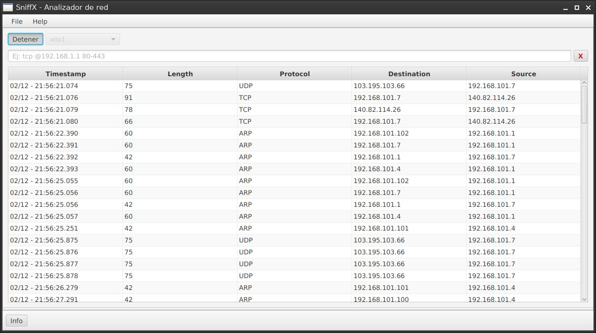
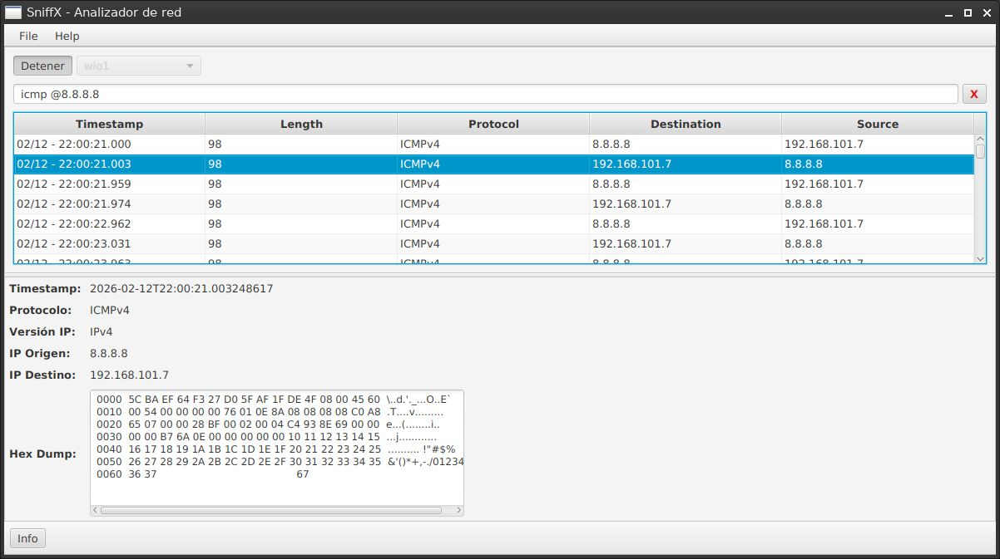
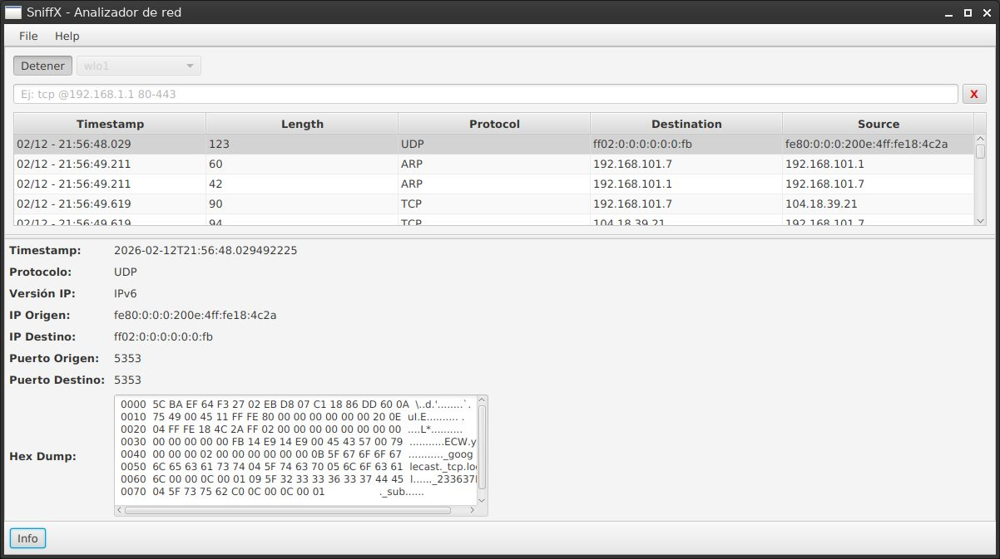

# SniffX

SniffX es un sniffer de red de escritorio escrito en Java 21, JavaFX y Pcap4J.
Actualmente está enfocado en:

- captura básica de paquetes por interfaz,
- visualización de tráfico en tabla + detalle,
- aplicación de filtros BPF con sintaxis avanzada y alias amigables.

> Nota: el proyecto está en evolución. Se prioriza una experiencia simple, manteniendo compatibilidad con sintaxis BPF estándar.

## Estado actual del proyecto

### Lo que sí está implementado

- Captura en vivo desde interfaces detectadas por libpcap/Npcap.
- Inicio/detención de captura desde UI.
- Disección de protocolos comunes (Ethernet, ARP, IPv4/IPv6, ICMPv4/ICMPv6, TCP, UDP).
- Conversión de cada paquete a una vista enriquecida (`PacketDetails`) para la interfaz.
- Builder de filtros BPF con alias de alto nivel (`BpfFilterBuilder`).

### Lo que **no** está implementado todavía

- Estadísticas avanzadas en vivo (gráficas, métricas históricas, etc.).

Para detalles técnicos revisa:

- [Arquitectura](./docs/architecture.md)
- [Máquina de estados](./docs/state-machine.md)
- [Filtros soportados](./docs/filters.md)

## Requisitos

- JDK 21+
- Maven 3.9+
- JavaFX (se resuelve vía Maven)
- Librería de captura del sistema:
  - **Linux:** `libpcap`
  - **Windows:** `Npcap` (modo compatible con WinPcap)

## Compilar

```bash
mvn clean package
```

También puedes correr tests:

```bash
mvn test
```

## Ejecutar

### Opción 1: desde Maven (recomendado en desarrollo)

```bash
mvn javafx:run
```

### Opción 2: JAR generado

```bash
java -jar target/sniffx-1.0-SNAPSHOT.jar
```

## Permisos para capturar paquetes

La captura suele requerir privilegios elevados.

### Linux

Ejecutar como root:

```bash
sudo mvn javafx:run
```

O ejecutar el JAR con sudo:

```bash
sudo java -jar target/sniffx-1.0-SNAPSHOT.jar
```

> Alternativa más fina (fuera del alcance del proyecto): configurar capacidades/grupos para capturar sin sudo en cada ejecución.

### Windows

Ejecuta la app en una terminal con privilegios de administrador cuando sea necesario y verifica que Npcap esté instalado correctamente.

## Uso básico

1. Selecciona una interfaz de red.
2. (Opcional) escribe un filtro en sintaxis BPF o usando alias de SniffX.
3. Presiona **Iniciar**.
4. Selecciona paquetes para ver detalle y hexdump.
5. Presiona **Detener** para finalizar la captura.

## Capturas de pantalla

> Coloca las imágenes en `docs/images/` con los nombres indicados para que se rendericen en GitHub.

### 1) Vista principal de captura



<sub>Panel principal durante una captura activa, mostrando tabla de paquetes con timestamp, longitud, protocolo y direcciones origen/destino.</sub>

### 2) Filtro aplicado + detalle de paquete



<sub>Ejemplo de filtro (`icmp and @8.8.8.8`) y visualización del detalle del paquete seleccionado con hexdump.</sub>

### 3) Detalle extendido (IPv6/UDP)



<sub>Detalle enriquecido del paquete (versión IP, puertos origen/destino y volcado hexadecimal) para análisis rápido en la UI.</sub>

## Contribuir

Si quieres aportar mejoras, crea un fork y abre un PR contra la rama `develop`. Revisa también la guía en [`CONTRIBUTING.md`](./CONTRIBUTING.md).

## Licencia

Este proyecto está licenciado bajo MIT. Consulta [`LICENSE`](./LICENSE).

---

Proyecto desarrollado por Juan E. Euse, inspirado en flujos de análisis de red tipo Wireshark.
