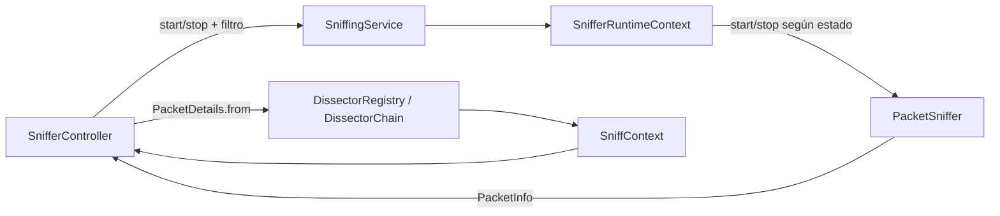

# Arquitectura de captura y disección

## Flujo principal

El recorrido de un paquete en SniffX sigue esta cadena:

1. **`SnifferController`** (capa UI) recibe acciones del usuario (iniciar/detener, filtro, interfaz).
2. **`SniffingService`** coordina la operación de captura y separa la UI del motor de runtime.
3. **`SnifferRuntimeContext`** aplica la máquina de estados (`STOPPED` / `RUNNING` / `ERROR`) y decide si puede iniciar o detener.
4. **`PacketSniffer`** interactúa con `pcap4j`, abre la interfaz, aplica BPF y emite paquetes a observadores.

En términos de eventos:

- La UI dispara `startCapture(interface, bpf)` o `stopCapture()`.
- El runtime delega en `PacketSniffer.start(...)` o `PacketSniffer.stop()` según el estado actual.
- `PacketSniffer` notifica objetos `PacketObserver` con `PacketInfo` por cada paquete capturado.
- `SnifferController` transforma `PacketInfo` en `PacketDetails` para mostrar tabla y panel de detalle.

## Responsabilidad de `dissector/*`

La carpeta `dissector/*` implementa una **cadena de disección**:

- `DissectorRegistry` construye una cadena única y registra disectores de Ethernet, ARP, IPv4/IPv6, ICMPv4/ICMPv6, TCP y UDP.
- `DissectorChain` recorre todos los disectores registrados y ejecuta sólo los que soportan el paquete.
- Cada dissector extrae campos relevantes y los vuelca en `SniffContext` (IPs, puertos, protocolo, flags, etc.).

Esto permite mantener el parsing de protocolos desacoplado del controlador y del motor de captura.

## Modelos `PacketInfo` y `PacketDetails`

- **`PacketInfo`**: modelo "crudo" de evento de captura.
  - Contiene `Packet` original de pcap4j.
  - Guarda `timestamp` y `hexDump` calculado al momento de recepción.
- **`PacketDetails`**: modelo listo para UI.
  - Se construye con `PacketDetails.from(PacketInfo)`.
  - Usa `DissectorRegistry.getChain().dissect(raw)` para poblar protocolo, IPs, puertos, flags, longitud y hexdump.

En resumen: `PacketInfo` representa el evento técnico de captura; `PacketDetails` representa la vista enriquecida para presentación.

## Diagrama (Mermaid)

